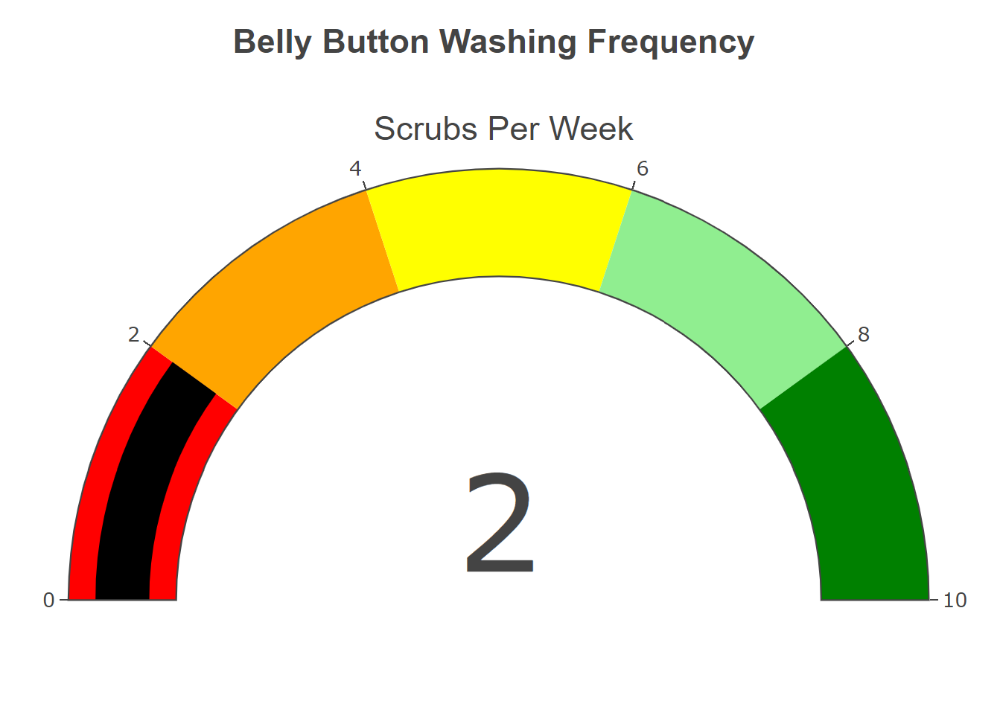

# Belly Button Diversity Dashboard

## Overview of Project

In this project, an interactive dashboard was created to explore the Belly Button diversity dataset, which is in JSON format and lists the microorganisms that infect human navels.

The data shows that a small number of microbial species (referred to in the study as operational taxonomic units, or OTUs) were found in more than 70% of persons, while the rest were uncommon.

Demographics information is dynamically populated based upon  a user-selected test subject ID. A bar chart, bubble chart and a bonus gauge chart also update once the ID is changed. Code has been written using Plotly, JavaScript, HTML, CSS, and D3.js.

**The dashboard can be viewed here: Belly Button Diversity Dashboard**

## Deliverables

The task was to gather demographic information from test subjects and create a bar and bubble chart depicting each individual's samples. This was accomplished in the following manner:

* Read in `samples.json`. This is done using the D3 library.
* Retrieve metadata information for each test subject and show it as a key-value pair on the dashboard in the form of an unordered list item.
* Get the data you need for charting, such as'sample values,' 'otu ids,' and 'otu labels,' which were used to make the trace and plot the bar chart.
* Since the task was to only plot the top 10 values, the three arrays were sliced and reversed to display the chart as below.

* The entire sample arrays were used to plot a bubble chart.

* The bonus challenge was to create a gauge chart.

## Dashboard

Bootstrap and custom CSS was used to pretty up the dashboard. A screenshot of the dashboard can be seen below.

